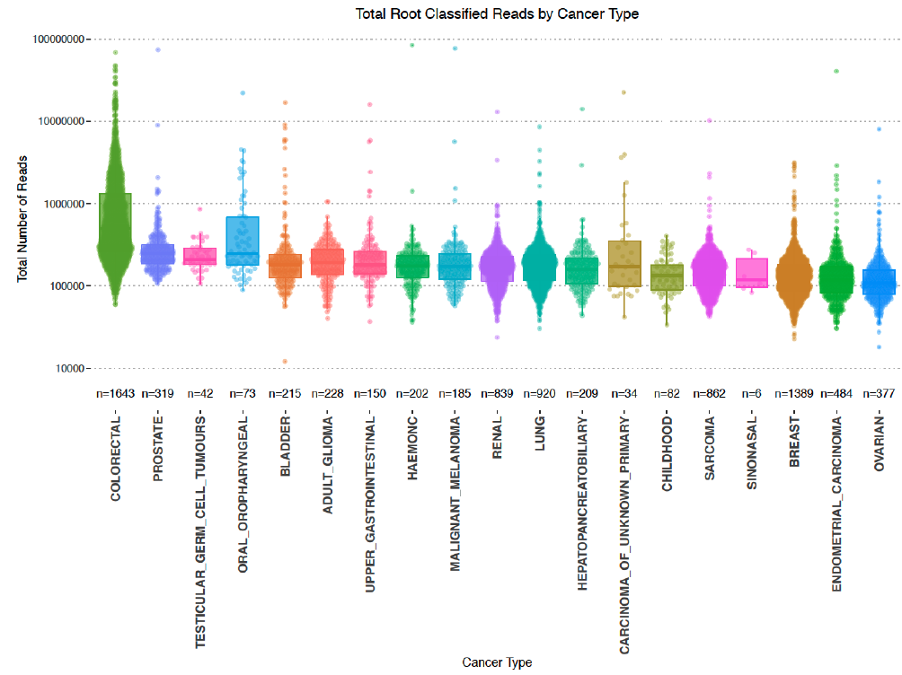

```{r, include=FALSE}
knitr::opts_chunk$set(echo = FALSE,
                      warning = FALSE,
                      tidy = FALSE,
                      message = FALSE,
                      fig.align = 'center',
                      out.width = "100%")
options(knitr.table.format = "html") 

library(posterdown)
library(tidyverse)
library(ggpubr)
library(devtools)
library(kableExtra)
library(magrittr)
library(ggbeeswarm)
library(EnvStats)
```

# Background

The role of _Helicobacter pylori_[@RN102] and Human papillomavirus[@RN138] in gastric and cervical cancer are testament to the prominent role that pathogens can play in cancer. When submitting tumours to whole genome sequencing, it is possible to indicentally sequence microbes in close proximity[@RN455]. We have been using the 100,000 Genomes Project as a rich resource to search for evidence of microbial DNA.

We benchmarked software to devise the best approach for cancer whole genome sequence metagenomics. The top performing approaches are provided in a tool called [SEPATH](https://github.com/UEA-Cancer-Genetics-Lab/sepath_tool_UEA) [@RN454] which performs the following:

* Extracts unmapped reads from BAM files
* Quality trimming & human read depletion
* Metagenomic classification with Kraken[@RN72]

Additionally, we have also been investigating the taxonomy and functional potential of contigs produced by metagenomic assembly.


# Methods

Non-human reads were extracted and classified using [SEPATH](https://github.com/UEA-Cancer-Genetics-Lab/sepath_tool_UEA). Classifications from PCR-free, fresh-frozen samples (*N*=7,775) with $<20$ reads were filtered. Taxa were removed according to published '*black lists*' of common contaminants[@Eisenhofer2019]. Ordination was carried out with [Rtsne](https://cran.r-project.org/web/packages/Rtsne/Rtsne.pdf) (perplexity=90, max_iter=2,000) on a matrix of Spearman's distances created with the [ClassDiscovery](https://rdrr.io/rforge/ClassDiscovery/) package.

Metagenomic assembly was carried out on non-human reads pooled by cancer type with [MEGAHIT](https://github.com/voutcn/megahit)[@RN269]. Taxonomic classifications of contigs were obtained with [DIAMOND](https://github.com/bbuchfink/diamond)[@RN204] with [NCBI non-redundant proteins](https://www.ncbi.nlm.nih.gov/refseq/about/nonredundantproteins/).


Functional potential of putative proteins was estimated using [Prokka](https://github.com/tseemann/prokka)[@Seemann2014] and [InterProScan](https://github.com/ebi-pf-team/interproscan)[@Jones2014].


# SEPATH Results

Colorectal and oral cancers demonstrate the greatest median number of microbial reads. A background number of classified reads exists throughout all cancer types.

```{r, cancertype, fig.cap='Microbial reads in each tumour type'}
 
```


#### Colorectal and Oral Cancers Show Distinctive Microbial Communities

```{r, cancertypetsne, fig.cap="t-SNE plot of cancer samples using Spearman's distance coloured by tumour type. Colorectal and oral cancer are shown in green and blue respectively and separate out into clusters in the bottom half of the plot. This plot was produced using a reduced set of 652/1534 genera.", out.width="108%"}
 knitr::include_graphics("images/krakentsne.png")
```

<br>

# Assembly Results

Assembling microbial reads within each tumour type has resulted in a total of 17.8 million contigs. The number of contigs produced by each cancer type was positively correlated with the number of reads submitted to each assembly (Spearman's $\rho = 0.87$)

```{r asscontaminants, echo=FALSE, message=FALSE, warn=FALSE, fig.cap="The number of contigs in each assembly after removing mammalian and common contaminant genera. Colorectal samples were excluded due to being prohibitively large to assemble as one pool", fig.asp=.75, fig.align='center'}

ass_contaminants <- data.frame(
  cancer = c('Adult Glioma', 'Bladder', 'Breast', 'Childhood', 'Endocrine', 'Endometrial', 'Hepatopancreatobiliary', 'Lung', 'Melanoma',  'Nasopharyngeal',  'Oral',  'Other', 'Ovarian', 'Prostate', 'Renal', 'Sarcoma', 'Sinonasal', 'Testicular', 'Unknown', 'Upper_GI'),
  contaminant_contigs = c(46194, 59471, 251751, 25299, 11523, 32577, 21910, 183866, 38262, 574, 91704, 226, 64766, 139852, 113138, 102468, 10178, 338, 9865, 30565),
  total_contigs = c(193250, 270135, 736463, 87305, 25786, 118361, 239266, 395738, 152147, 8053, 837594, NA, 202519, 441758, 572682, 413857, 52239, 8036, NA, 130926 )
)

ass_contaminants %<>% mutate(remaining_contigs = total_contigs - contaminant_contigs)

ass_filt <- ass_contaminants %>% filter(!is.na(remaining_contigs))

remain_contigs <- ggplot(ass_filt, aes(x=reorder(cancer, -remaining_contigs), y=remaining_contigs/1000000)) +
  geom_bar(stat='identity', fill='goldenrod2', alpha=0.7) +
  theme_pubclean() + 
  coord_flip() +
  labs(y='Number of Remaining Contigs (million)') +
  theme(axis.title.y=element_blank()) +
  scale_y_continuous(breaks=c(seq(0,1,0.1)))

remain_contigs
```

<br>

# Functional Results

5,264 different pathways were reported across all ontologies, representing ~10% of all known metabolic pathways. This data has been made available via:  [https://UEA-Cancer-Genetics-Lab.github.io/Pancancer_Microbial_Pathways/](https://UEA-Cancer-Genetics-Lab.github.io/Pancancer_Microbial_Pathways/).

This has suggested some tantalising pathways for future research such as *"PD-L1 expression and PD-1 checkpoint pathway in cancer"*

It is hoped that this resource can provide researchers with an additional strand of evidence for a non-human pathway existing in cancer.

The number of pathway hits was correlated with the number of assembled contigs (Spearman's  $\rho = 0.92$) and is therefore sensitive to the sample size. For this reason it is not advisable to investigate differences between cancer types.

```{r allpathways, echo=FALSE, message=FALSE, warn=FALSE, fig.cap="The distribution of pathway hits within all cancer types across all ontologies. The number of pathways for each ontology is demonstrated on the x-axis", fig.asp=.75, fig.align='center'}

all_pathways <- read_tsv(file='https://raw.githubusercontent.com/UEA-Cancer-Genetics-Lab/Pancancer_Microbial_Pathways/master/data/pancancer_pathways.tsv')

ggplot(all_pathways, aes(x=ontology, y=pancancer)) +
  geom_quasirandom(aes(col=ontology)) +
  geom_boxplot(alpha=0.5) +
  scale_y_log10() +
  theme_minimal() +
  labs(x='Pathway Ontology',
       y='Total Pathway Database Hits') +
  theme(legend.position='none',
        axis.text.x=element_text(angle=45, hjust=1)) +
  stat_n_text()


```

# Conclusions

- SEPATH suggests limited pancancer microbial structure.

- This may be caused by inbalances in reference genomes available.

- Metagenomic assembly is a reference-independent approach that may reveal more about pancancer microbial structure.

- All metabolic pathways reported have been made available for researchers.

- This resource should be used for hypothesis generation or as preliminary evidence for a pathway in cancer.


# Ongoing Tasks

The technical difficulties of assembling colorectal data has been circumvented by dividing the pooled reads into six sets. In order to fairly compare cancer types, a single database must be created. To do this, we have concatenated all assembled contigs which contains >18 million contigs. To reduce this database and remove redundancy we have selected representative sequences by clustering with [CD-HIT](https://github.com/weizhongli/cdhit/wiki)[@Li2006] which has removed 8 million contigs. Each sample is currently being pseudo-aligned to this pancancer database with [Kallisto](http://pachterlab.github.io/kallisto/)[@Bray2016].


# Acknowledgements

This poster was created in [posterdown](https://github.com/brentthorne/posterdown) and the code to do so is available on [GitHub](https://github.com/UEA-Cancer-Genetics-Lab/EACR_Bioinformatics_2021)

Thanks to [Genomics England](http://www.genomicsengland.co.uk) including participants and staff as well as [Big C](http://www.big-c.co.uk/) and [Prostate Cancer UK](https://prostatecanceruk.org/) for supporting this project.

```{r, logos, out.width="100%"}
  knitr::include_graphics("resources/logos.png")
```

### References
